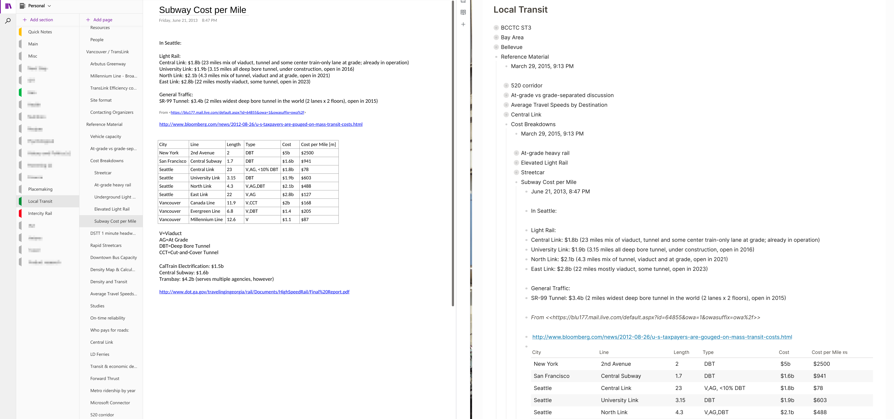

**OneNote Markdown to Logseq Processor** is a console application for Linux or Windows which takes Markdown files exported from OneNote notebooks and processes them into a format that is more suitable for importing into Logseq.

What this tool does:
* Takes the output of a OneNote to Markdown exporter (specific ones listed below) which typically convert each OneNote page to a Markdown file.
* Combines all pages belonging to a OneNote Section into a single Markdown file
* Ensures each OneNote page has a parent block and the contents of the page are a child to that block.
* Ensures original page hierarchy from OneNote is preserved in new format.

This will recreate your OneNote page hierarchy from a given section within a single page in Logseq.

|From||To|
|---|---|---|
||=>||

You can see that the hierarchy of pages has been transformed into a hierarchy of blocks in Logseq. This model is particularly useful for people who create a large number of small pages and use the hierarchy to organize their notes by fairly granular topics. Converting each one of these pages to a separate Markdown file will create potentially too many pages in Logseq.

# How to use

1. This script takes Markdown as an input, so you first have to convert your OneNote notebooks to Markdown. There are two popular convertors supported with one being recomended:

Recommended - **OneNoteMdExporter**: https://github.com/alxnbl/onenote-md-exporter
Secondary option - **ConvertOneNote2MarkDown**: https://github.com/theohbrothers/ConvertOneNote2MarkDown

These are both very simple to run, generally just run the program, answer a few questions and they will produce an output.

2. Run OneNoteMD2Logseq:

`python3 onmd2ls.py --input_folder /path/to/folder/with/md2s --format onenote-md-exporter|ConvertOneNoteToMarkDown`

The two parameters above are the most likely ones you will need. Here is description of all parameters:

|Parameter|Description|
|---|---|
|--input_folder|The folder where the markdown files you want to take are. Note that the above converters generally produce one folder per section, so you will have to run the script once per section. As described before, it will place all pages from that section in a single page for Logseq use with the hierarchy preserved within blocks.\n\nDefault value: current folder.|
|--output_folder|The folder where the output should be placed. The script will create a sub-folder called `for_logseq` with subfolders `pages` and `assets` which will contain the new MD file and renamed versions of the images and other linked assets. You have to copy the contents of these folders to the same folders in your graph folder.\n\nThis is an optional parameter and the default is the same as the input folder.|
|--add_property_metadata|If true, this will add the created and updated dates as properties under the top block denoting a page (that block usually contains the page title).|
|--format|Specify whether you used `onenote-md-exporter` or `ConvertOneNoteToMarkDown` to produce the input Markdown files.|

3. Copy the produced output files to your graph.

As stated in the parameter table, the script will create a sub-folder called `for_logseq` with subfolders `pages` and `assets` which will contain the new MD file and renamed versions of the images and other linked assets. You have to copy the contents of these folders to the same folders in your graph folder

# Features and limitations

| Feature| Support |
| --- | --- |
| Ensure all content is a block | ✅ |
| Limited white-space clearance for more Logseq-appropriate results | ✅ |
| Page hierarchy to blocks | ✅ |
| Page hierarchy to TOC, preserving individual pages | 🔴 |
| Preserve order of hierarchy, rather than force alphabetical | 🔴 |

# License

Released under the Apache 2.0 license.

This software carries no warranty of any kind. Some data can be lost during the conversion process. Always keep a backup of the source and double or triple verify the exported result before using it.

# Contribute

I am unlikely to be able to dedicate much or any time for supporting this.

Bugs and feature requests can be reported under [Issues](https://github.com/antonba/OneNoteMD2Logseq/issues.
